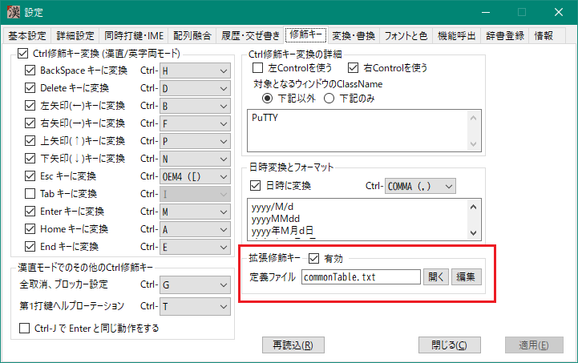
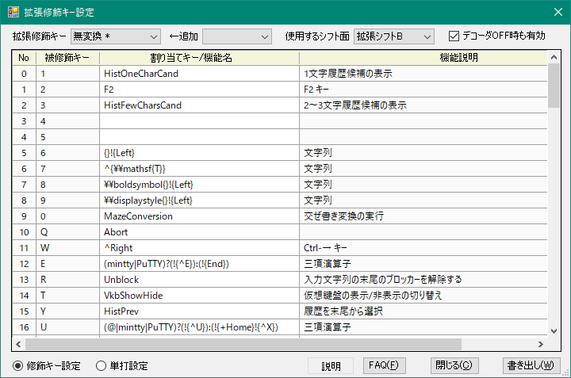
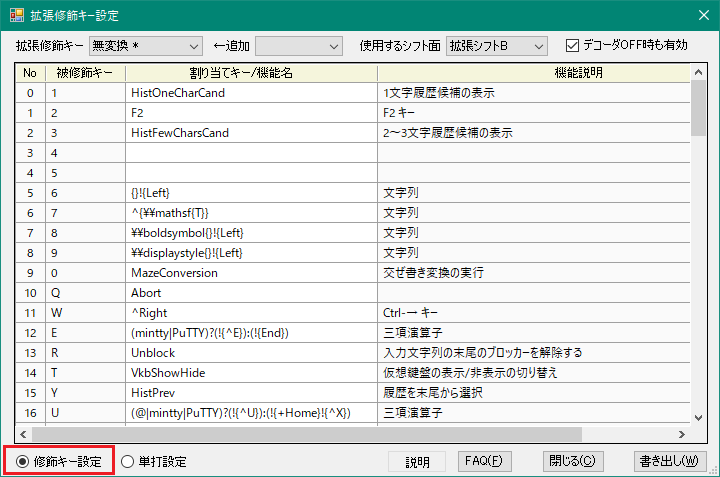
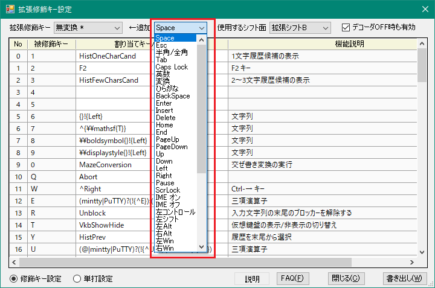
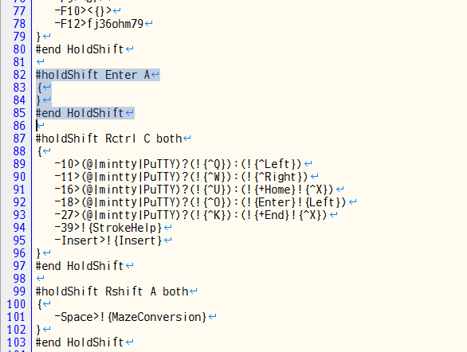
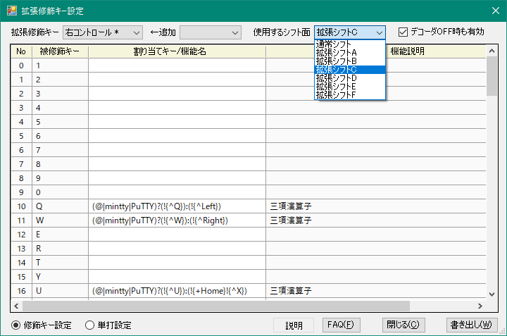
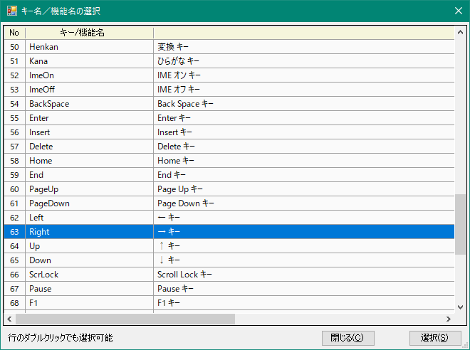
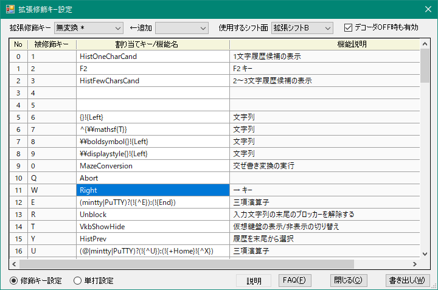
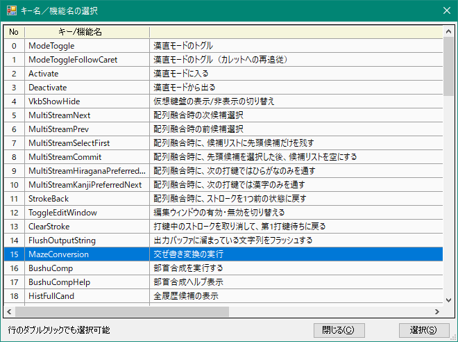
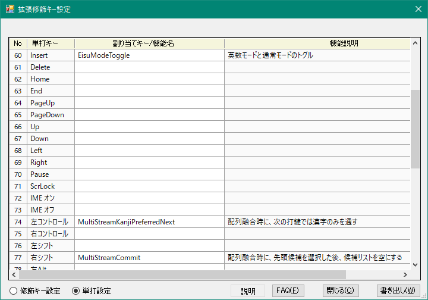

###### [FAQ HOME](../FAQ.md#FAQ-HOME)

# FAQ キーアサイン編

## 目次
- [各種キーを修飾キーとして使う(拡張修飾キー)](#各種キーを修飾キーとして使う拡張修飾キー)
- [定義する拡張修飾キーの選択](#定義する拡張修飾キーの選択)
    - [拡張修飾キーを追加する](#拡張修飾キーを追加する)
    - [拡張修飾キーを削除する](#拡張修飾キーを削除する)
- [拡張シフト面の割り当て](#拡張シフト面の割り当て)
- [被修飾キーへの割り当て](#被修飾キーへの割り当て)
    - [機能キーを割り当てる](#機能キーを割り当てる)
    - [漢織媛コマンドを割り当てる](#漢織媛コマンドを割り当てる)
    - [CtrlやShift修飾されたキーを割り当てる](#CtrlやShift修飾されたキーを割り当てる)
    - [複合機能キーを割り当てる](#複合機能キーを割り当てる)
    - [配列コードを割り当てる](#配列コードを割り当てる)
    - [文字列を割り当てる](#文字列を割り当てる)
- [特殊キーに対する単打設定](#特殊キーに対する単打設定)
- [機能名一覧](#機能名一覧)
- [複合機能キーの記述](#複合機能キーの記述)
    - [機能キー記述](#機能キー記述)
    - [キー名のエイリアス設定](#キー名のエイリアス設定)
    - [Ctrl修飾、Shift修飾、Alt修飾](#Ctrl修飾Shift修飾Alt修飾)
    - [3項演算記述](#3項演算記述)
    - [使用できる機能キーの名前](#使用できる機能キーの名前)
    - [任意の仮想キーコードの使用](#任意の仮想キーコードの使用)

## 各種キーを修飾キーとして使う(拡張修飾キー)
Space、CapsLock, 英数, 無変換, 変換, ひらがな, BS, Enter, 左右シフト, 左右コントロール, 左右Altなど様々なキーを修飾キー（シフトキー）として使用し、
通常シフト面、拡張シフト面A～F のいずれかに割り当てることができます。

この機能を利用すると、たとえば「無変換 + W」に対して `^Right` （Ctrl + 右矢印キー）を割り当てて、無変換+W を押下することで文字カーソルの単語移動ができるようになります。

拡張修飾キーは、下図のように「修飾キー」>「拡張修飾キー」で設定することができます。先に「有効」にチェックを入れておいてください。



初期状態では、`commonTable.txt` は用意されていません。
もし、漢直WSで使用していた `mod-conversion.txt` というファイルがあれば、それを `userFiles` フォルダにコピーしておき、（既に存在していれば `userFiles/commonTable.txt` を削除してから）「再読込」ボタンをクリックすると、`mod-conversion.txt` の内容を読み込んで `commonTable.txt` を作成します。

「開く」ボタンをクリックすると、テキストエディタでそのファイルを開いて内容を確認することができます。

「編集」ボタンをクリックすると、下図のような「拡張修飾キー設定」ダイアログが開きます。
拡張修飾キーに対する割り当てを修正する場合は、
エディタで上記ファイルを直接編集するよりもこちらを使うほうが便利です。



「書き出し」をクリックすると、表示されている内容が定義ファイルに書き出されるので、
「再読込」をクリックしてそれらの修正内容を漢織媛に反映させてください。

もし、複数のキー割り当てを一括で変更したいのであれば、定義ファイルをエディタなどで直接修正したほうが簡単かもしれません（定義ファイルは、配列テーブルファイルと同様の矢印記法を採用しています）。
修正内容をファイルに保存した後「再読込」をクリックすると、その内容が拡張修飾キー設定ダイアログにも反映されます。

## 定義する拡張修飾キーの選択
「拡張修飾キー設定」ダイアログの下部にあるラジオボタンで「修飾キー設定」をクリックしてください。



上部の「拡張修飾キー」コンボボックスで拡張修飾キーを選択します。

### 拡張修飾キーを追加する
新しい拡張修飾キーを定義したい場合は、「追加」コンボボックスをクリックして追加したいキーを選択してください。
追加したキーが「拡張修飾キー」コンボボックスに入ります。



### 拡張修飾キーを削除する
不要になった拡張修飾キーを削除する場合は、「開く」ボタンをクリックし、定義ファイルをエディターで開いて、該当する定義部分を削除してください。

下図は誤って追加してしまった `Enter` を、定義ファイルから削除しようとしているところです。



## 拡張シフト面の割り当て
拡張修飾キーには、それを展開するための拡張シフト面を割り当てる必要があります。
割り当てる拡張シフト面は「使用するシフト面」コンボボックスから選択してください。



## 被修飾キーへの割り当て
対象となる被修飾キーの行の「割り当てキー／機能名」列のセルに割り当てるキー名や機能名を入力します。

### 機能キーを割り当てる
矢印キーや BS, Enter, Home, End などの機能キーを割り当てたい場合は、割り当て対象の被修飾キーの行をダブルクリックします。
下図のようなダイアログが開くので、ここから選択してください。
表の後半が機能キー名になっています。



機能キーをクリックして「選択」ボタンをクリックするか、あるいは機能キーをダブルクリックすると、選択したキーの名前が修飾キー設定画面に反映されます。



### 漢織媛コマンドを割り当てる
交ぜ書き変換や配列融合での候補選択確定のような、漢織媛に対するコマンドを割り当てたい場合も、
割り当て対象の被修飾キーの行をダブルクリックします。
表の前半がコマンド名になっています。



### CtrlやShift修飾されたキーを割り当てる
選択した機能キー名、あるいは `A`〜`Z` のキー名の頭に `^` を付加することで、 Ctrl修飾されたキーを表すことができます。
たとえば、`^Left` は「Ctrl＋左矢印」に、`^S` は「Ctrl＋S」になります。
これらのキーを入力する場合は、いったんセルを選択状態にした後、F2 を押すかセルを再クリックすると、
セルへの直接入力モードになるので、直接入力してください。

付加できるは、`^` (Ctrl), `+` (Shift), `!` (Alt) です。これらを複数個重ねて設定することもできます。
たとえば、`^+Right` は 「Ctrl+Shift+Right」を表します。

### 複合機能キーを割り当てる
セル直接入力モードを使って、
`!{+End}!{^X}` のような[複合機能キー呼び出し](#複合機能キーの記述)も割り当てられます。

### 配列コードを割り当てる
セル直接入力モードを使って、`40` や `A26` のように、通常面や拡張シフト面に対する配列コードを記述することができます。

### 文字列を割り当てる
(複合)機能キー、コマンド、配列コードに該当しないものは文字列として扱われます。
これらに該当するが文字列として扱いたい、という場合はダブルクォート(`"`)で囲んでください。

## 特殊キーに対する単打設定
「拡張修飾キー設定」ダイアログの下部にあるラジオボタンで「単打設定」をクリックしてください。



「単打キー」列に記載された機能キーの単打（キーを押してすぐ離す操作）に対して、
「割り当てキー／機能名」列に記載のキーや機能を割り当てることができます。

設定方法は、前項「拡張修飾キーの割り当て」と同様です。

## 機能名一覧

|No.|コマンド名|機能|
|-|-|-|
|0|ModeToggle|漢直モードのトグル|
|1|ModeToggleFollowCaret|漢直モードのトグル（カレットへの再追従）|
|2|Activate|漢直モードに入る|
|3|Deactivate|漢直モードから出る|
|4|VkbShowHide|仮想鍵盤の表示/非表示の切り替え|
|5|MultiStreamNext|配列融合時の次候補選択|
|6|MultiStreamPrev|配列融合時の前候補選択|
|7|MultiStreamSelectFirst|配列融合時に、候補リストに先頭候補だけを残す|
|8|MultiStreamCommit|配列融合時に、先頭候補を選択した後、候補リストを空にする|
|9|MultiStreamHiraganaPreferredNext|配列融合時に、以降の打鍵ではひらがなのみを通す|
|10|MultiStreamKanjiPreferredNext|配列融合時に、次の打鍵では漢字のみを通す|
|11|StrokeBack|配列融合時に、ストロークを1つ前の状態に戻す|
|12|ClearStroke|打鍵中のストロークを取り消して、第1打鍵待ちに戻る|
|13|FlushOutputString|出力バッファに溜まっている文字列をフラッシュする|
|14|MazeConversion|交ぜ書き変換の実行|
|15|BushuComp|部首合成を実行する|
|16|BushuCompHelp|部首合成ヘルプ表示|
|17|HistFullCand|全履歴候補の表示|
|18|HistFewCharsCand|2～3文字履歴候補の表示|
|19|HistOneCharCand|1文字履歴候補の表示|
|20|HistNext|履歴を先頭から選択|
|21|HistPrev|履歴を末尾から選択|
|22|FullEscape|入力途中状態をクリアし、入力文字列の末尾にブロッカーを置く。履歴候補もクリアされる|
|23|Unblock|入力文字列の末尾のブロッカーを解除する|
|24|BlockerToggle|入力文字列の末尾のブロッカーを設定・解除する", "toggleblocker|
|25|EisuModeToggle|英数モードと通常モードのトグル|
|26|EisuModeCancel|英数モードをキャンセルする|
|27|EisuConversion|英数モードで英字列をカタカナに変換する|
|28|EisuDecapitalize|英数モードで先頭文字を小文字化する|
|29|ZenkakuConversion|全角変換入力モードのON/OFF|
|30|KatakanaConversion|カタカナ入力モードのON/OFF|
|31|KanaTrainingToggle|かな入力練習モードと通常モードを切り替える|
|32|DateRotate|日時変換の入力(フォーマットの正順切替)|
|33|DateUnrotate|日時変換の入力(フォーマットの逆順切替)|
|34|HelpRotate|ストロークヘルプの正順回転|
|35|HelpUnrotate|ストロークヘルプの逆順回転|
|36|StrokeHelp|最後に入力した文字のストロークヘルプ|
|37|RomanStrokeGuide|打鍵ガイドへのローマ字による読み入力モードのON/OFF(読み入力OFF後にガイド開始)|
|38|UpperRomanStrokeGuide|英大文字ローマ字による読み打鍵ガイドモード|
|39|HiraganaStrokeGuide|ひらがな入力による読み打鍵ガイドモード|
|40|CopyAndRegisterSelection|アクティブウィンドウに Ctrl-C を送りつけて、選択されている部分をクリップボードにコピーし、それをデコーダの辞書に送って登録する。形式はミニバッファへのコピペによる辞書登録と同じで、履歴、交ぜ書き、連想の3通りの登録が可能",
|41|ShiftSpace|Shift+Space に変換|
|42|DirectSpace|デコーダを通さずに直接Spaceをアプリに送る|

※ コマンド名は大文字・小文字を区別しません。


## 複合機能キーの記述
### 機能キー記述
打鍵に割り当てられる出力文字列は、ダブルクォートで囲むことで複数の文字を含むことができます。
この文字列中に `!{keyName}`というような文字列を記述すると、*keyName* に相当する機能キーを出力できます。

例： `無変換+P` に対して
```
"!{Up}"
```
という記述をすると、無変換キーを押しながら`P` を押下したときにカレット(文字カーソル)を上移動できるようになります。

また、下記のように *KeyName* の後に空白(またはコロン)を置いてその後に数字を書くと、その数字の回数だけ、
キー入力が繰り返されます。

```
"!{Left 3}"
```

*keyName* と機能キーの対応については、後述の
[使用できる機能キーの名前](#使用できる機能キーの名前)
を参照してください。

機能キーを複数出力する例については、下記を参照ください。

#### 仮想キーコード(VK)記述
上述の「機能キー記述」と似た方法で、任意の仮想キーコードを出力することもできます。

仮想キーコードを出力するには、文字列として `!{VKxx}` という記述をします。
たとえば「ImeOn」(仮想キーコード: 0x16)を出力したい場合は、次のように記述します。

```
-xfer>"!{VK16}"
```

これは、「変換」キーに仮想キーコード 0x16 の出力を割り当てています。

### キー名のエイリアス設定
「薙刀式」配列には、縦書き版と横書き版があり、両版の違いは、
カーソル移動用の同時打鍵に割り当てる移動方向のみとなっています。

このようなケースに簡単に対応できるようにするため、 *KeyName* に対するエイリアスを定義できるようにしました。
下記は、薙刀式[横書き版]のテーブルファイルの内容です。

```
#define display-name "薙刀式配列v15（fix版）横"

;;***********************************************
;; 縦書き用の定義ファイルを読み込む
;;***********************************************
#include "naginata15fix.tbl"

;;***********************************************
;; 矢印キーの再定義
;;***********************************************
#defineKey ↑ Left
#defineKey ↓ Right
#defineKey ← Down
#defineKey → Up
```

縦書き版のテーブルファイルを include した後に、矢印キーを再定義しています。このように、

```
#defineKey 別名 KEYNAME
```

という形式で *KeyName* に対する別名を定義することができます。
このような定義があると、次のような形で機能キーの記述ができるようになります。

```
-T>"!{←}"
```

なお、別名定義が重複した場合は、後から定義したほうが有効となります。

### Ctrl修飾、Shift修飾、Alt修飾
*keyName* には `^` 、 `+` および `!` を前接させることができます。
`^` を前接させると  Ctrl 修飾となり、`+` を前接させると Shift 修飾となります。
また `!` を前接させると Atl 修飾となります。
Ctrl修飾およびAlt修飾の場合は、*keyName* として `A`～`Z` を用いることもできます。

例：拡張シフトB面（「複数のシフト面」参照）の`W`(Qwerty/106)に `Ctrl+Shift+右矢印 - Ctrl+X` （カーソルの左1単語のカット）を割り当てる
```
-B11>"!{^+Left}!{^X}"
```

`^`  `+` `!` には、`<`(左)と`>`(右)の指定も行えます。

例：拡張シフト面の D を打鍵したとき、 右Ctrl-D を出力する
```
-B22>"!{>^D}"
```

### 3項演算記述
`(...)?(...):(...)` というような形式で3項演算を記述することができます。

第1項(条件部)には式を適用するウィンドウクラス名を記述します。
先頭の条件部で指定されたウィンドウクラス名がアクティブウィンドウのクラス名とマッチしたら第2項を返し、
マッチしなかったら第3項を返します。

例：拡張シフト面の W を打鍵したとき、 mintty や PuTTY なら Ctrl-W を出力し、
それ以外なら Ctrl-Shift-左矢印, Ctrl-X を出力する (つまり文字カーソルの左単語の削除)
```
-B11>"(mintty|PuTTY)?(!{^W}):(!{^+Left}!{^X})"
```

上記のように、ウィンドウクラス名は `|` をはさんで連結することによって複数個を指定することができます。

### 使用できる機能キーの名前

機能キーと keyName の対応は下記のようになります。keyName は大文字・小文字を区別しません。

|機能キー|keyName|
|-|-|
|エスケープ|Esc, Escape|
|半角／全角|Zenkaku|
|タブ|Tab|
|CapsLock|Caps, CapsLock|
|英数|Alnum, AlphaNum, Eisu|
|無変換|Nfer|
|変換|Xfer|
|ひらがな|Kana, Hiragana|
|IME オン|ImeOn|
|IME オフ|ImeOff|
|BackSpace| BS, Back, BackSpace|
|Enter|Enter|
|Pause|Pause|
|Insert|Ins, Insert|
|Delete|Del, Delete|
|Home|Home|
|End|End|
|Page Up|PgUp, PageUp|
|Page Down|PgDn, PageDown|
|↑|Up, UpArrow|
|↓|Down, DownArrow|
|←|Left, LeftArrow|
|→|Right, RightArrow|

どのキーを押したときにどのような仮想キーコードが発生するかは、同梱の `KeyboardHookMonitor`
を使って調べられます。
[こちら](https://github.com/oktopus1959/KeyboardHookMonitor#readme)に説明があります。

### 任意の仮想キーコードの使用
「IME オン」(0x16)、「IME オフ」(0x1a)、「F13」(0x7c) のように、
一般的な物理キーボードには存在しないキーを出力したい場合は、
`VKxx` または `vkxx` (`xx` のところは16進数)という名前を指定してください。

例： HとJの同時押しで「IMEオン」を出力する

```
#combination oneShot
-$H,$J>"!{vk16}"
#end combination
```

（なお、「IME オン」「IME オフ」については、`ImeOn` `ImeOff` というキー名も用意してあります）
