###### [FAQ HOME](../FAQ.md#FAQ-HOME)

# FAQ 交ぜ書き変換編

## 目次

- [交ぜ書き変換って何ですか](#交ぜ書き変換って何ですか)
- [変換キーの設定](#変換キーの設定)
- [ユーザー辞書登録](#ユーザー辞書登録)

## 交ぜ書き変換って何ですか

## 変換キーの設定
現状、従来のように配列定義の中で交ぜ書き変換キーを設定することができないので、
拡張修飾キーで設定してください。
以下は、無変換キーを拡張修飾キーとして使用し、「`無変換+K`」を交ぜ書き変換キーとして設定する例です。

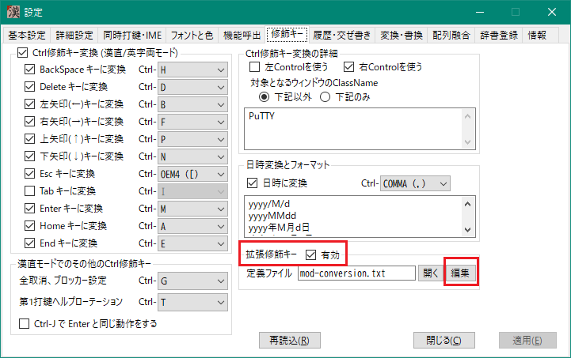

まず、無変換キーに対して拡張シフト面を設定します。以下では拡張シフトB面を設定しています。 
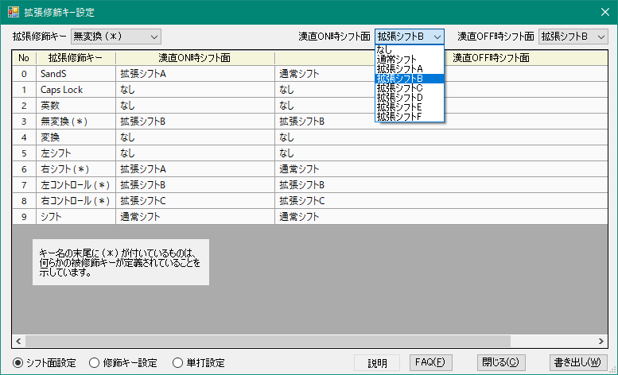

修飾キー設定で無変換キーを選択し、`K` の「割り当てキー/機能名」のセルをダブルクリックします。

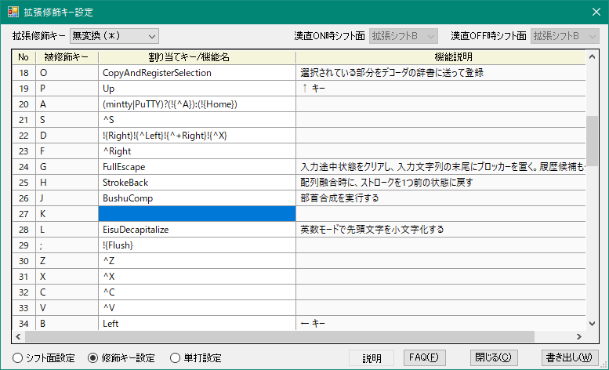 

機能名選択で、「`MazeConversion`」を選択します。 
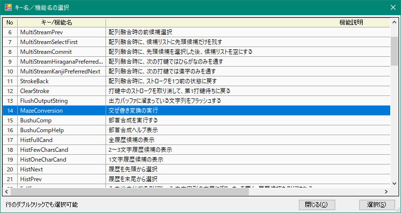

`MazeConversion` が設定されていることを確認したら、`書き出し`をクリックします。 
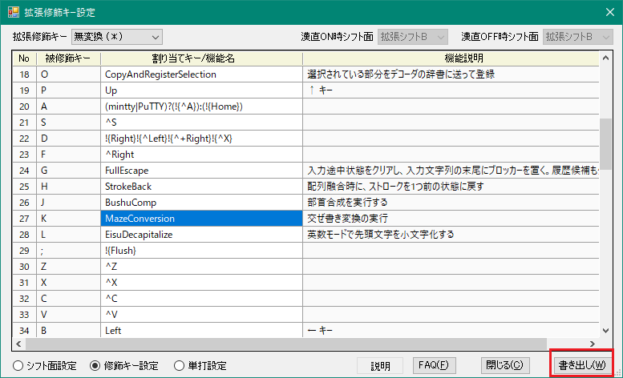

元の画面に戻ったら、「`再読込`」をクリックします。 
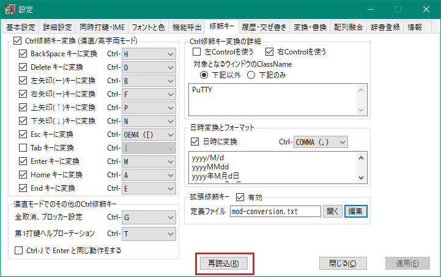

以上。

## ユーザー辞書登録
「履歴・交ぜ書き」タブを開き、「交ぜ書きユーザー辞書」の「開く」をクリックします。 
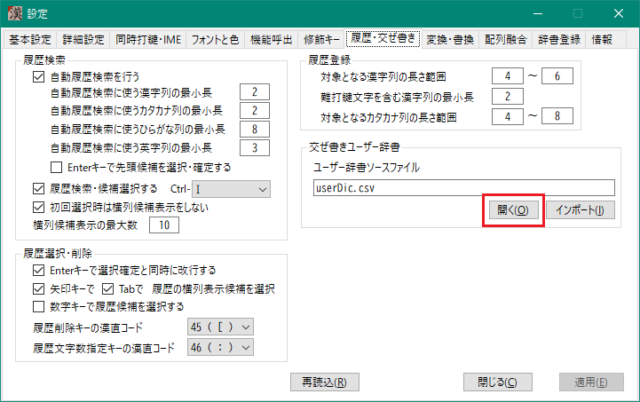

テキストエディターが開いて、`userFiles/userDic.csv` ファイルの内容が表示されます。 
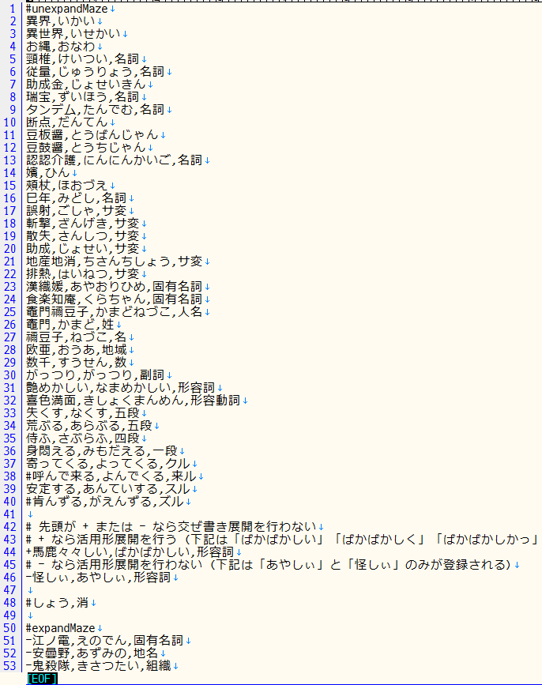

この辞書はサンプルなので、不要なものは削除してください。

1行に1エントリを記述します。フォーマットは次のようになっています。

`読み,変換形,品詞,重み`

このうち、 `品詞`と`重み`は省略できます。
- `品詞` を省略すると `名詞` になる
- `重み` を省略すると 5000 が設定される

`品詞` には以下のものがあります。
|名称|説明|
|-|-|
|名詞|一般名詞|
|サ変|名詞であり、「～する」という形の動詞にもなるもの|
|固有名詞|人名、地名、組織名などの固有名詞一般|
|人名|人名を表す固有名詞|
|姓|姓を表す固有名詞|
|名|名を表す固有名詞|
|地域|地域を表す固有名詞|
|地名|地名を表す固有名詞|
|組織|組織を表す固有名詞|
|数|数詞|
|副詞|副詞|
|形容詞|形容詞|
|形容動詞|形容動詞。「~な」という表現が可能なもの|
|五段|五段活用する動詞|
|一段|一段活用する動詞|
|クル|「くる」「こない」「きて」のような活用をする動詞|
|来ル|「来る」「来ない」「来て」のような活用をする動詞|
|スル|「～する」「~しない」「~して」のような活用をする動詞。語幹が名詞にならないもの|
|ズル|「～ずる」「~じない」「~じて」のような活用をする動詞|

辞書の追加や修正が終わってファイルを保存したら、「インポート」をクリックします。 
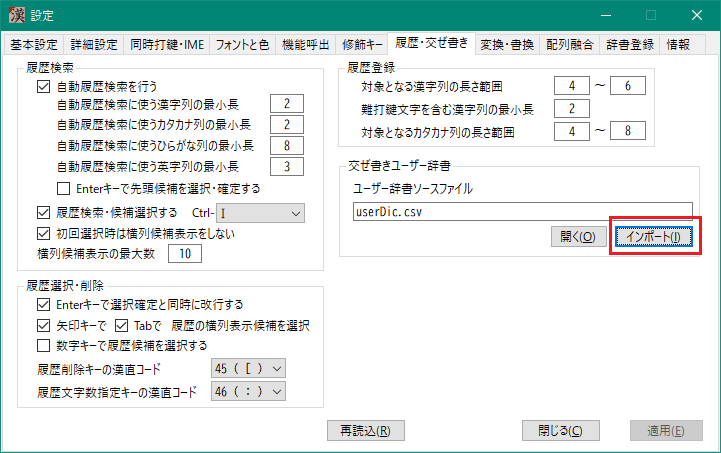

以下のような結果が表示されればOKです。 
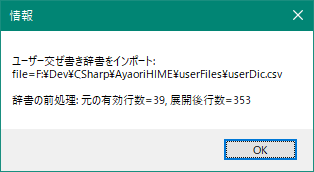

記述に間違いがあると、現状、次のような不親切な表示になります。
いずれエラー箇所を表示するようにする予定ですが、現状はがんばって目視でエラー箇所を探してください。 
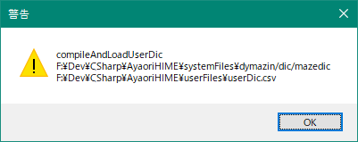