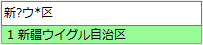
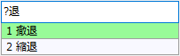
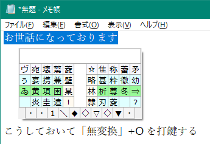

###### [FAQ HOME](../FAQ.md#FAQ-HOME)

# FAQ 簡易辞書検索編

## 目次

## 簡易辞書とは
一行に一つの文字列だけを登録した、簡易な辞書です。
入力中の文字列の末尾の部分文字列と登録したエントリの先頭部が一致したら、そのエントリ全体を出力するような辞書です。

## 簡易辞書検索
たとえば、以下のようなエントリが辞書登録されている場合に、「本日はありが」まで入力して簡易辞書検索キーを押すと、末尾の「ありが」が「ありがとうございます」に置換されます。
```
ありがとうございます
```


### ワイルドカードの利用

簡易辞書検索のキーには、ワイルドカード(`?` と `*`)を使うことができます。
`?` は任意の1文字に、`*`は0文字以上の任意の文字列にマッチします。

たとえば、後述の簡易辞書登録を利用して「新疆ウイグル自治区」という文字列を辞書に登録しておくと、
「新?ウ*区」という入力がこれにマッチして、以下のような候補表示が得られます。



また、先頭文字が直接打鍵できないような熟語についても、
「?退」などと入力すると次のような候補を得ることができます。



ただし、以下のような制限があります。
- `*`は高々1個だけ
- `*`を含む場合は、両側に4文字以下のキーが必要

## 簡易辞書登録
ひらがなを含む語や、漢字・カタカナ混在語、あるいはいったん削除した語は、手動で登録します。
登録方法には下記の3通りがあります。

- 仮想鍵盤の上部ミニバッファに文字列をコピペする
- 選択状態の文字列に対して後述の拡張修飾キーで CopyAndRegisterSelection コマンドを呼び出す
- 設定ダイアログの「英数字・カタカナ・簡易辞書」>「簡易辞書登録」で登録する

たとえば「お世話になっております」を登録するには、
この文字列をコピーして仮想鍵盤のミニバッファにペーストするか、
この文字列を選択状態にしておいて CopyAndRegisterSelection を呼び出すか、
あるいは「簡易辞書登録」のところで直接入力して「登録」ボタンを押します。

ちなみに作者は、 CopyAndRegisterSelection を 「無変換」+`O` に割り当てています。



### 変換形
簡易辞書登録の応用として、「変換形」登録があります。これは、
```
キー文字列 | 変換形文字列
```
という形式で登録しておくと、選択された際にキー文字列を「変換形文字列」に置換して出力する、
というものです。

たとえば、
```
DKRED|<span style="color: darkred">
```
という登録をしておいて、漢直モードで「DKR」と打つと上記候補が表示されるので、それを選択すると
`DKR` が `<span style="color: darkred">` で置換される、というわけです。

以下のような登録もできます。
```
おねす|お願いいたします
おせす|お世話になっております
あざす|ありがとうございます
```

これは、英字列からカタカナへの変換の際にも利用されています。