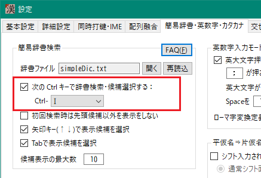
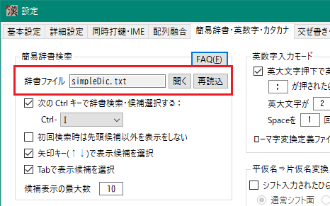
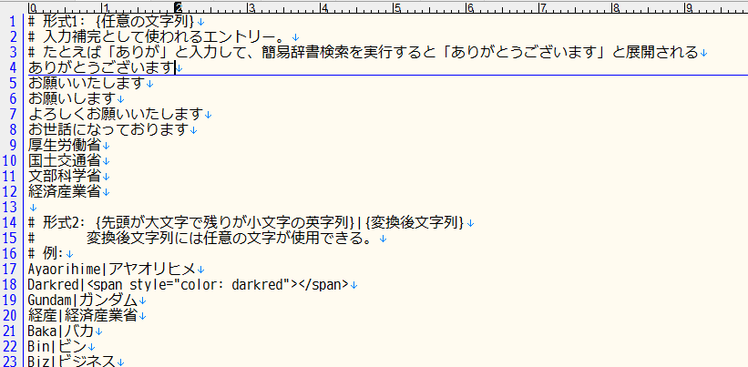

###### [FAQ HOME](../FAQ.md#FAQ-HOME)

# FAQ 簡易辞書検索編

## 目次
- [簡易辞書とは](#簡易辞書とは)
- [簡易辞書検索](#簡易辞書検索)
    - [ワイルドカードの利用](#ワイルドカードの利用)
    - [変換形](#変換形)
- [簡易辞書登録](#簡易辞書登録)

## 簡易辞書とは
入力補完や短縮語入力、英字カタカナ変換などに使用される辞書です。
一行に一つの文字列または `短縮形|変換形` を登録する、簡易な辞書です。
入力中の文字列の末尾の部分文字列と、登録したエントリの先頭部が一致したら、そのエントリの全体または`変換形`で置換するような辞書です。

## 簡易辞書検索
たとえば、以下のようなエントリが辞書登録されている場合に、「本日はありが」まで入力して簡易辞書検索キーを押すと、末尾の「ありが」が「ありがとうございます」に置換されます。
```
ありがとうございます
```

検索キーは以下の設定ダイアログの「簡易辞書・英数字・カタカナ」タブで設定できます。



### ワイルドカードの利用

簡易辞書検索のキーには、ワイルドカード(`?` と `*`)を使うことができます。
`?` は任意の1文字に、`*`は0文字以上の任意の文字列にマッチします。

たとえば、後述の簡易辞書登録を利用して「新疆ウイグル自治区」という文字列を辞書に登録しておくと、
「新?ウ*区」という入力がこれにマッチして、以下のような候補表示が得られます。


また、先頭文字が直接打鍵できないような熟語についても、
「?退」などと入力すると次のような候補を得ることができます。


ただし、以下のような制限があります。
- `*`は高々1個だけ
- `*`を含む場合は、両側に4文字以下のキーが必要

### 変換形
簡易辞書登録の応用として、「変換形」登録があります。これは、
```
キー文字列|変換形文字列
```
という形式で登録しておくと、選択された際にキー文字列を「変換形文字列」に置換して出力する、
というものです。

たとえば、
```
DKRED|<span style="color: darkred">
```
という登録をしておいて、漢直モードで「DKR」と打つと上記候補が表示されるので、それを選択すると
`DKR` が `<span style="color: darkred">` で置換される、というわけです。

以下のような登録もできます。
```
おねす|お願いいたします
おせす|お世話になっております
あざす|ありがとうございます
```

これは、英字列からカタカナへの変換の際にも利用されています。

## 簡易辞書登録
簡易辞書は `userFiles/simpleDic.txt` というファイルで登録します。下記ダイアログ画面で `開く` ボタンをクリックすると、このファイルがエディターで開きます。



ここに入力補完をしたい文字列や短縮語・英字列から変換したい文字列を登録してください。



編集後、ファイルを保存して、 `再読込` ボタンをクリックすると、辞書ファイルの内容が取り込まれます。
