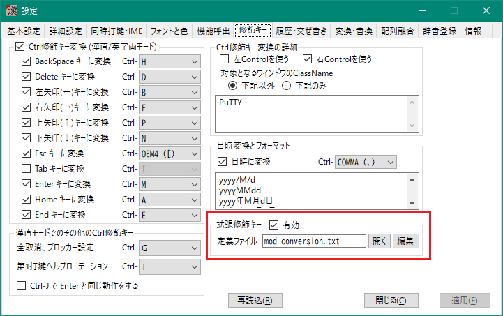
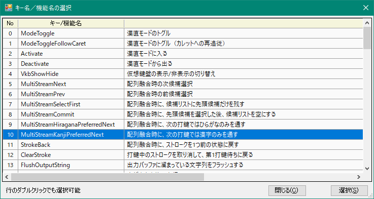
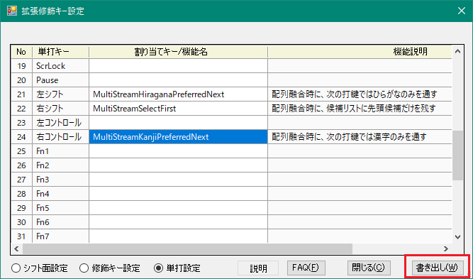
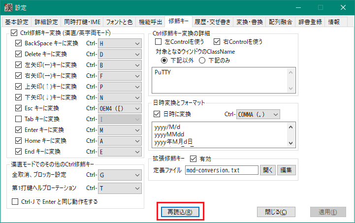
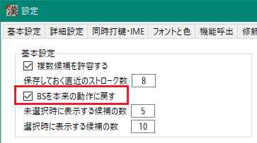

###### [FAQ HOME](../FAQ.md#FAQ-HOME)

# FAQ 配列融合編

## 目次

- [配列融合って何ですか](#配列融合って何ですか)
- [薙刀式とTUT-Codeを同時に使いたい](#薙刀式とTUT-Codeを同時に使いたい)
- [意図しない入力になってしまう](#意図しない入力になってしまう)
    - [特定の語の Ngram コストを上げ下げしたい](#特定の語の-Ngram-コストを上げ下げしたい)
    - [特定の Ngram 対は、候補選択によるボーナスポイントの上げ下げをなくしたい](#特定の-Ngram-対は候補選択によるボーナスポイントの上げ下げをなくしたい)
- [次の打鍵では漢字（ひらがな）の入力を優先させたい](#次の打鍵では漢字（ひらがな）の入力を優先させたい)
- [編集バッファを有効にする](#編集バッファを有効にする)
- [BSでの文字削除の動きが気持ち悪いです](#BSでの文字削除の動きが気持ち悪いです)


## 配列融合って何ですか
かな配列と漢直配列の両方を設定しておき、打鍵列に対してどちらの配列の文字を採用するかを統計的に決定する方式のことです。

文字の優先順位は、形態素解析とNgram解析の両方の計算結果の合計値で決定されます。形態素解析とNgram解析用の辞書は別となっています。

形態素解析用の辞書は交ぜ書き変換の辞書と同じものであり、たとえば「き重」のような交ぜ書きも一つの形態素として扱われることになります。ただし交ぜ書き形態素は元の漢字だけの形態素(たとえば「貴重」)に比べると優先度が下がります。


## 薙刀式とTUT-Codeを同時に使いたい
主テーブルファイルと副テーブルファイルにそれぞれの配列を設定します。


「c;iwCcnreki」「..fpCcnreki」と打ってみてください。ここで、大文字のCは薙刀式のセンターシフトで C のキーを打鍵することを示します。以下のような結果になると思います。


## 意図しない入力になってしまう
前項で、「..fpCcnreki」と打鍵した場合は、本当は「彼女を愛している」になってほしかったはずです。
他の入力候補を見ると、2番目にそれがあります。下矢印(↓)キーでそれを選択してみてください。
画面が書き換わって、「彼女を愛している」になります。

もう一度「..fpCcnreki」と打鍵してみましょう。やはり「彼女をはたしている」のままでしたか？
では、さらにもう一度。今度は「彼女を愛している」になったかと思います。

このように、何度か入力選択を行うと、少しずつ入力候補の順番が変化していきます。
この変化量を変更したい場合は、下図のように「配列融合」タブの「候補選択による加算ポイント」と
「ボーナスポイントの係数」を変更してみてください。
まずは「候補選択による加算ポイント」の値を増やしてみるところから始めてみてください。


### 特定の語の Ngram コストを上げ下げしたい
システム搭載の Ngram 解析では思うような入力候補が優先されてこない場合は、ユーザー設定により望みの語の優先順位を上げる(Ngramコストを下げる)ことができます。

`userFiles/user.ngram.txt` をエディターで開き、
```
猫猫 5
```
のように「Ngram <空白> ボーナスポイント」の形で記述します。上の例は「猫猫」という 2gram に対して5ボーナスポイントを追加することを定義しています。こうすると、入力候補に「猫猫」という 2gram が出現した場合は、その候補に対して「ボーナスポイント × ボーナスポイント係数」だけ Ngram コストが下がります。

なお、このファイルに記述できるのは、2gram または 3gram に限定されています。

### 特定の Ngram 対は、候補選択によるボーナスポイントの上げ下げをなくしたい
たとえば、「迎え」と「抑え」が同一のストローク列で入力できたとします。この2つの 2gram は、動詞としての活用型が同じなので、形態素解析的には優劣をつけるのが困難です。このような場合は、常に「迎え」のほうを優先させて、「抑え」を出したい場合は候補選択をするというのが楽でしょう。

`userFiles/user.ngram.txt` に次のような記述をします。

```
迎え $5
抑え $0
```

この `$` は「候補選択をしてもボーナスポイントの加減算をしない」ということを表します。`$` の後の数字は固定で追加されるボーナスポイントです。こういう定義をすることによって、「迎え」には常に5ボーナスポイントが加算され、「抑え」にはその加算がない、ということになります。これにより、「迎え」を含む候補が優先的に出力されるようになり、「抑え」を選択したとしても優先度には変化がない、ということになります。

## 次の打鍵では漢字（ひらがな）の入力を優先させたい
`MultiStreamKanjiPreferredNext` (`MultiStreamHiraganaPreferredNext`)というコマンドが用意されています。これを使用するには、拡張修飾キー設定を行います。

次のように「拡張キー設定」を有効にして「編集」ボタンをクリックしてください。<br>


「FAQ-交ぜ書き変換#変換キーの設定」を参考にして、適当なキーに対して「キー名/機能名選択」ダイアログを開きます。`MultiStreamKanjiPreferredNext` というコマンドがあるのでそれを選択します。



選択して元の画面に戻ったら、「書き数し」をクリックします。
ここで作者は「右コントロール」キーの単打に割り当てていることが分かるかと思います。



最後に「再読込」をクリックして完了です。<br>


## 編集バッファを有効にする
入力文字列の書き換えは、BSで古い文字列を削除してその後に新しい文字列をアプリに対して送出します。
メモ帳などの軽いアプリでは問題になりませんが、最近のAI用のCLIなど、文字入力が重いアプリだともたつくようなこともあるかと思います。

そのような場合は、編集バッファを試してみてください。


カレット(文字カーソル)の位置に次のような文字入力ウィンドウが表示され、いったんそこで文字列入力・編集してから Enter を押すと対象アプリに文字列を送り込みます(バッファのフラッシュ)。


「編集バッファをフラッシュさせる文字」を設定すると、その文字を入力した時自動で編集バッファがフラッシュされます。

## BSでの文字削除の動きが気持ち悪いです
配列融合モードでは、BS はデフォルトで、「末尾文字を消去するのに必要な分だけストローク列を戻す」という動作をします。これによって打鍵ミスによって意図しない漢字やかなに変換された場合でも、BSを打つことで元の入力文字列に戻せるようになるのですが、この動きが「気持ち悪い」と感じることもあるでしょう。

そのような場合は、以下ように「BSを本来の動作に戻す」にチェックを入れてください。見た目通りに末尾から1文字ずつ文字を削除するようになります。

