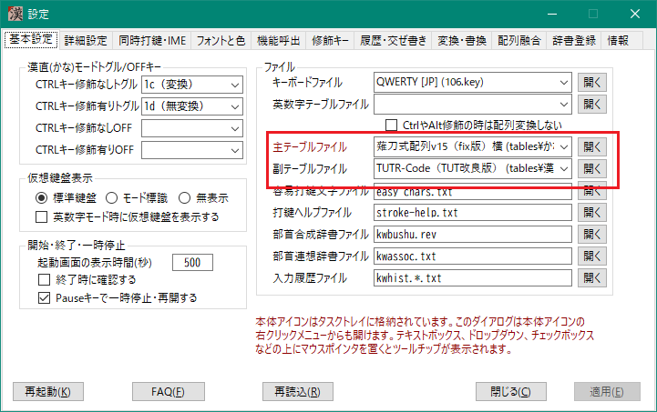
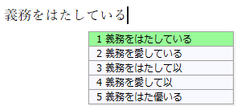
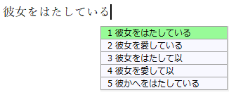
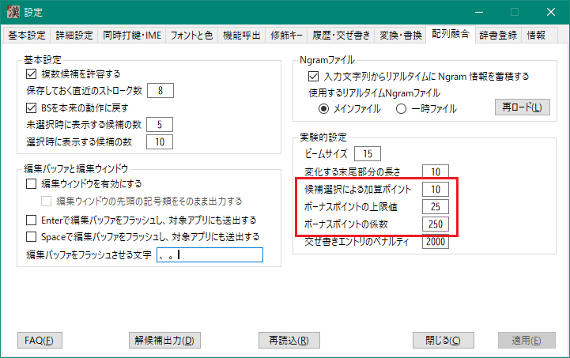
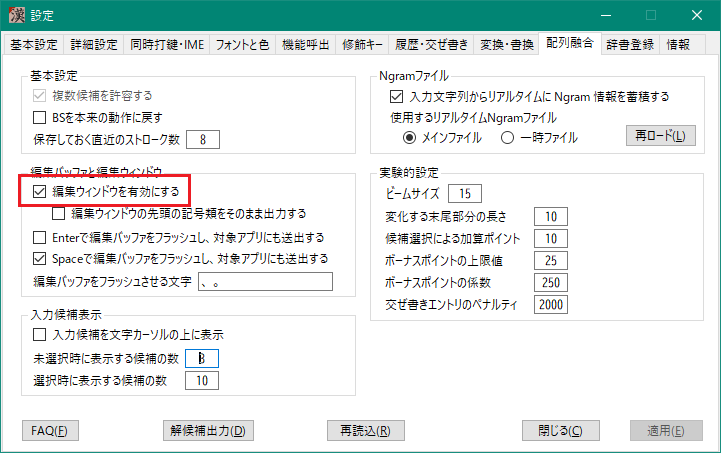
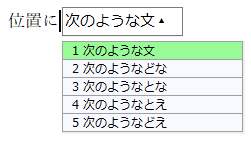

###### [FAQ HOME](../FAQ.md#FAQ-HOME)

# FAQ 配列融合編

## 目次

## 配列融合って何ですか

## 薙刀式とTUT-Codeを同時に使いたい
主テーブルファイルと副テーブルファイルにそれぞれの配列を設定します。

「c;iwCcnreki」「..fpCcnreki」と打ってみてください。ここで、大文字のCは薙刀式のセンターシフトで C のキーを打鍵することを示します。以下のような結果になると思います。

## 意図しない入力になってしまう
前項で、「..fpCcnreki」と打鍵した場合は、本当は「彼女を愛している」になってほしかったはずです。
他の入力候補を見ると、2番目にそれがあります。下矢印(↓)キーでそれを選択してみてください。
画面が書き換わって、「彼女を愛している」になります。

もう一度「..fpCcnreki」と打鍵してみましょう。やはり「彼女をはたしている」のままでしたか？
では、さらにもう一度。今度は「彼女を愛している」になったかと思います。

このように、何度か入力選択を行うと、少しずつ入力候補の順番が変化していきます。
この変化量を変更したい場合は、下図のように「配列融合」タブの「候補選択による加算ポイント」と
「ボーナスポイントの係数」を変更してみてください。
まずは「候補選択による加算ポイント」の値を増やしてみるところから始めてみてください。

## 編集バッファを有効にする
入力文字列の書き換えは、BSで古い文字列を削除してその後に新しい文字列をアプリに対して送出します。
メモ帳などの軽いアプリでは問題になりませんが、最近のAI用のCLIなど、文字入力が重いアプリだともたつくようなこともあるかと思います。

そのような場合は、編集バッファを試してみてください。

カレット(文字カーソル)の位置に次のような文字入力ウィンドウが表示され、いったんそこで文字列入力・編集してから Enter を押すと対象アプリに文字列を送り込みます(バッファのフラッシュ)。

「編集バッファをフラッシュさせる文字」を設定すると、その文字を入力した時自動で編集バッファがフラッシュされます。
